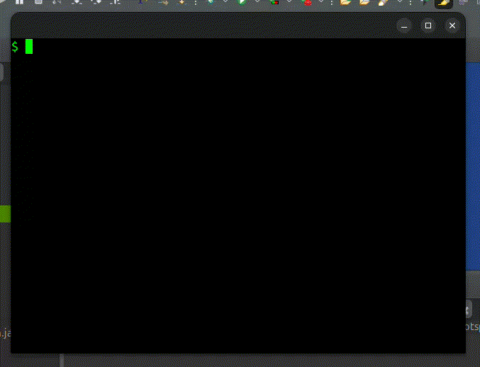

# Custom Shell

A custom Unix-like shell developed in Java, implementing various shell commands and features.

## Demo

The GIF below demonstrates the implemented commands and their execution:



## How to Run

To run the shell, execute the `Task3Main.java` class located at:

```text
shell/task3/shell/task3/Task3Main.java
```

